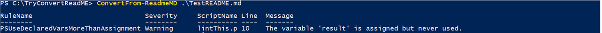
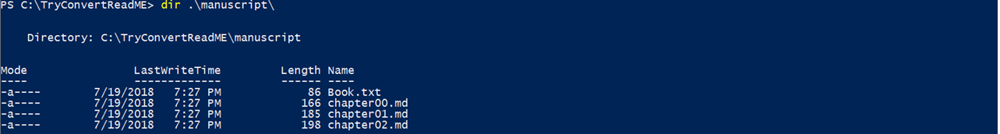

<p align="center">
<a href="https://ci.appveyor.com/project/dfinke/convertfrommarkdown/branch/master"></a>
</p>

## Convert From Markdown: In Action Video

Check it out, How to ConvertFrom-Markdown with all the bells and whistles.

<a href="http://www.youtube.com/watch?feature=player_embedded&v=z41g58gwdFw" target="_blank">

</a>


<!-- [](https://www.youtube.com/watch?v=YOUTUBE_VIDEO_ID_HERE) -->

## Updates

- Added `KeepLintFile` switch
- Added try/catch around `Invoke-ScriptAnalyzer`
- Added `<!-- EXCLUDE CODE START -->` and `<!-- EXCLUDE CODE END -->`. For example, if have code blocks that define the same class, you can exclude
 it so PSScriptAnalyzer doesn't fail

# Convert From Markdown
Quickly re-purpose your markdown as input to a service like LeanPub (for self publishing), and run the PowerShell ScriptAnalyzer against your PowerShell samples in the markdown.

This PowerShell module significantly improves your workflow for authoring your PowerShell `README.md`

Leveraging markdown, a typical workflow is creating a README.md for your PowerShell module/scripts. Describing your functions,  parameters and how they operate. Next, supplying examples of these functions in action, and followed by sample output.

While this is a great way to communicate with your audience, it causes a few problems for you, the author. First it locks your documentation into your README, making it difficult to re-purpose, for example as input to a service like LeanPub, a platform which is the combination of two things: a publishing workflow and a storefront.

The second challenge is, how can you make sure that your PowerShell examples are correct? One way to solve this is you do the double work of "testing" the code you add to the markdown.

This module improves that with two simple additions to your markdown authoring.

## Fenced code blocks and Chapters

### Fenced code blocks
Fenced code blocks let you create highlighted coding in your `README`. You can create fenced code blocks by placing triple backticks ```.

Syntax highlighting can be done with ```ps. For example:

```
        ```ps
        function test {
            param(
                $name
            )
        }
        ```
```

Becomes this:
```ps
function test {
    param(
        $name
    )
}
```

### Chapters

In markdown you can have comments, they take the form of `<!-- -->`.
Let's leverage that with `<!-- CHAPTER START -->` an `<!-- CHAPTER END -->`

Wrapping sections of your markdown with these enable cool automation opportunities by becoming "`fenced chapter blocks`".

## Where are we?

By continuing to use `fenced code blocks`, and adopting `fenced chapter blocks`, next level automation can be achieved.

This module reads your markdown and when it finds these blocks it extracts two things. First it creates a manuscript (ready for LeanPub), by creating a `manuscript` directory and placing "`fenced chapter blocks`" in numbered `chapterNNN.txt` files, including a `book.txt`

Then, it pulls out the PowerShell code and runs the PowerShell ScriptAnalyzer on it, reporting any issues.


## In Action

Running the `ConverFrom-ReadmeMD` on a markdown file does a few things. It extracts the code in the fenced code blocks and runs the PowerShell ScriptAnalyzer against it

### The Analyzer


And, it extracts all the `fenced chapter blocks` into the `manuscript` director, ready for shipping to LeanPub for publishing.

### The Manuscript

Here is the extraction of the `fenced chapter blocks` ready for your book publishing.



## Summary

Re-purposing effort makes us more agile, improves cycle time (from idea to customers using it). This module bumps you up to the next level.

Enjoy